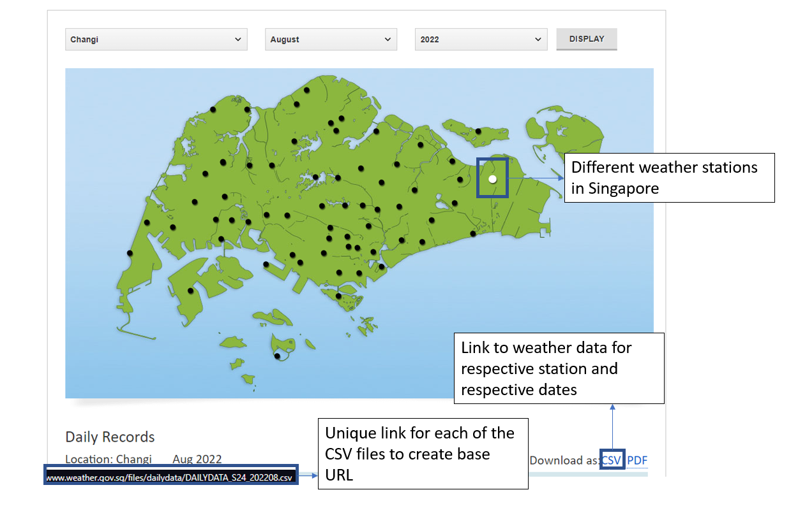

# Weather Scraping GUI for NEA Website

This project is a graphical user interface (GUI) application for downloading and merging weather data from the National Environment Agency (NEA) of Singapore's website. It allows users to select a range of dates and stations for which they wish to download the weather data, and then merges the data into a single CSV file for easier handling and analysis.

## Features

- **Download Weather Data**: Users can download daily weather data for a selected date range and set of weather stations from the NEA website.
- **Merge Data Files**: After downloading, users can merge all the CSV files into one single file for easier data analysis.
- **Interactive GUI**: All functionalities are accessible through an easy-to-use graphical interface, making the process straightforward even for non-technical users.

## Installation

Before running the application script, ensure you have the following prerequisites installed:

- Python 3.x
- Required Python packages: `PySimpleGUI`, `os`, `requests`, `csv`

You can install the required packages using pip:
```bash
pip install PySimpleGUI requests
```

# Demo


# Updated GUI Interface
- Loading bar added ✅
- Merging tool added ✅
- Auto create directory ✅
  <br>
<a href="https://ibb.co/wNKgV8h"></a>
# Future Plans
- Push to Firebase
- Plot rainfall / temperature trend graph for selected station

##Summary
Scraping weather historical weather data from different weather stations from : [Weather.gov.sg](http://www.weather.gov.sg/climate-historical-daily/)



