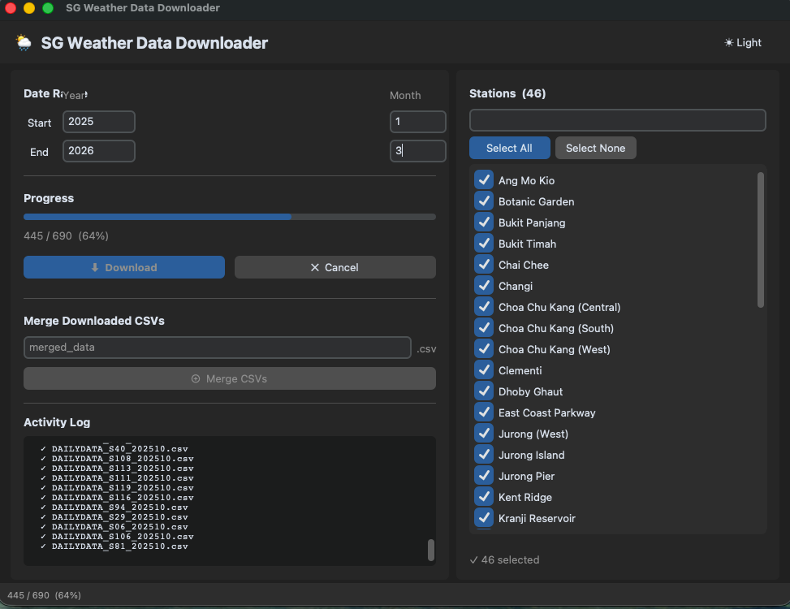
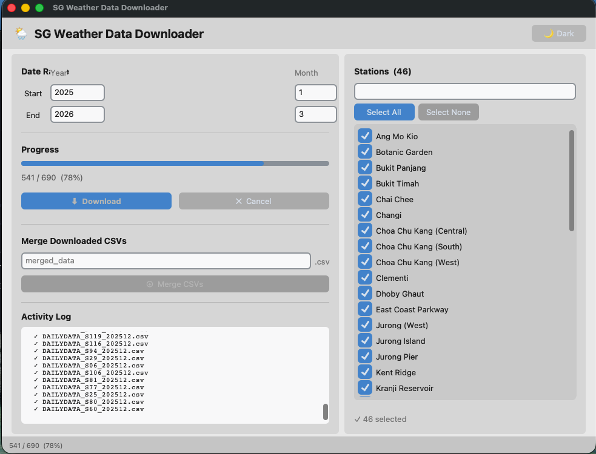

# 🌦 SG Weather Data Downloader

A modern desktop GUI application for downloading and merging historical daily weather data from Singapore's **National Environment Agency (NEA)**. Built entirely in Python with a clean dark/light theme.


| Dark Mode | Light Mode |
|---|---|
|  |  |

---

## Features

| Feature | Details |
|---|---|
| **Date range selection** | Pick any start/end year & month from 1980 to today |
| **46 weather stations** | All NEA monitoring stations pre-loaded |
| **Station search** | Filter the station list by name in real time |
| **Select All / None** | Quickly toggle all station checkboxes |
| **Threaded downloads** | UI stays responsive — progress updates live |
| **Cancel downloads** | Stop an in-progress download at any time |
| **Smart skip** | Already-downloaded files are skipped automatically |
| **CSV merge tool** | Combine all downloaded files into one CSV |
| **Activity log** | Per-file status (downloaded / skipped / failed) |
| **Dark & Light mode** | Toggle with a single button |

---

## Requirements

- **Python 3.12+** — Python 3.9 is not supported on macOS Tahoe (26) due to a Tk/macOS version incompatibility.
- **macOS (Apple Silicon or Intel), Windows, or Linux**

> **macOS Tahoe users:** install Python 3.12 and its Tk bindings via Homebrew before creating the venv:
> ```bash
> brew install python@3.12 python-tk@3.12
> ```

---

## Quick Start

### 1. Clone the repository

```bash
git clone https://github.com/unaveenj/SG-Weather-Scrapper-GUI.git
cd SG-Weather-Scrapper-GUI
```

### 2. Create & activate the virtual environment

```bash
# macOS / Linux — use python3.12 explicitly
python3.12 -m venv venv
source venv/bin/activate

# Windows
python -m venv venv
venv\Scripts\activate
```

### 3. Install dependencies

```bash
pip install -r requirements.txt
```

### 4. Run the app

```bash
python weather_gui.py
```

---

## Usage

1. **Set date range** — Enter a start and end year/month (e.g. `2023` / `1` → `2024` / `12`).
2. **Select stations** — Use the search box or Select All/None buttons. Check the stations you need.
3. **Download** — Click **⬇ Download**. Progress updates in real time; use **✕ Cancel** to stop.
4. **Merge** — Once downloaded, enter an output filename and click **⊕ Merge CSVs** to combine all files into one.

All files are saved to an `output/` folder created automatically in the working directory.

---

## Data Source

Weather data is fetched over HTTPS from NEA's public file server:

```
https://www.weather.gov.sg/files/dailydata/DAILYDATA_{STATION_ID}_{YEAR}{MONTH}.csv
```

Each CSV contains daily measurements (temperature, rainfall, wind, etc.) for one station per calendar month.

> **Note:** NEA's server requires requests to include a `Referer` header pointing to their climate page. The app handles this automatically — no action needed.

More info: [weather.gov.sg — Climate Historical Daily](http://www.weather.gov.sg/climate-historical-daily/)

---

## Stations Covered (46)

Ang Mo Kio · Botanic Garden · Bukit Panjang · Bukit Timah · Chai Chee · Changi · Choa Chu Kang (Central/South/West) · Clementi · Dhoby Ghaut · East Coast Parkway · Jurong (West) · Jurong Island · Jurong Pier · Kent Ridge · Kranji Reservoir · Lim Chu Kang · Lower Peirce Reservoir · Macritchie Reservoir · Mandai · Marine Parade · Marina Barrage · Newton · Nicoll Highway · Pasir Panjang · Pasir Ris (Central/West) · Paya Lebar · Pulau Ubin · Punggol · Queenstown · Sembawang · Sentosa Island · Serangoon · Seletar · Somerset (Road) · Tai Seng · Tanjong Katong · Tengah · Toa Payoh · Tuas · Tuas South · Tuas West · Ulu Pandan · Upper Peirce Reservoir

---

## Tech Stack

| Library | Purpose |
|---|---|
| [`customtkinter`](https://github.com/TomSchimansky/CustomTkinter) | Modern themed GUI (built on tkinter) |
| [`requests`](https://requests.readthedocs.io/) | HTTP downloads |
| `threading` | Non-blocking downloads (stdlib) |
| `csv`, `os` | File I/O (stdlib) |

> **Pure Python** — no compiled extensions required beyond standard pip packages.

---

## Project Structure

```
SG-Weather-Scrapper-GUI/
├── weather_gui.py      # Main application
├── requirements.txt    # Python dependencies
├── venv/               # Virtual environment (not committed)
├── output/             # Downloaded CSV files (auto-created)
└── README.md
```

---

## Future Plans

- [ ] Plot rainfall / temperature trend graphs per station
- [ ] Export summary statistics alongside merged CSV
- [ ] Push data to Firebase / cloud storage

---

## Contributing

Pull requests are welcome. Please open an issue first to discuss any significant change.

---

## License

MIT
